# AstroCircle - Complete Vedic Astrology Platform

AstroCircle is a comprehensive full-stack web application that provides personalized Vedic astrology services, including birth chart analysis, daily horoscopes, AI-powered astrological consultations, and detailed planetary position calculations. Built with modern web technologies and powered by DeepSeek AI.

## 🌟 Table of Contents

1. [Architecture Overview](#architecture-overview)
2. [Technology Stack](#technology-stack)
3. [System Architecture](#system-architecture)
4. [Authentication System](#authentication-system)
5. [Database Schema](#database-schema)
6. [API Routes Structure](#api-routes-structure)
7. [Frontend Components](#frontend-components)
8. [AI Integration (DeepSeek)](#ai-integration-deepseek)
9. [Astrology Features](#astrology-features)
10. [Development Setup](#development-setup)
11. [Deployment](#deployment)
12. [Security Features](#security-features)

## 🏗️ Architecture Overview

AstroCircle follows a modern full-stack architecture with clear separation of concerns:

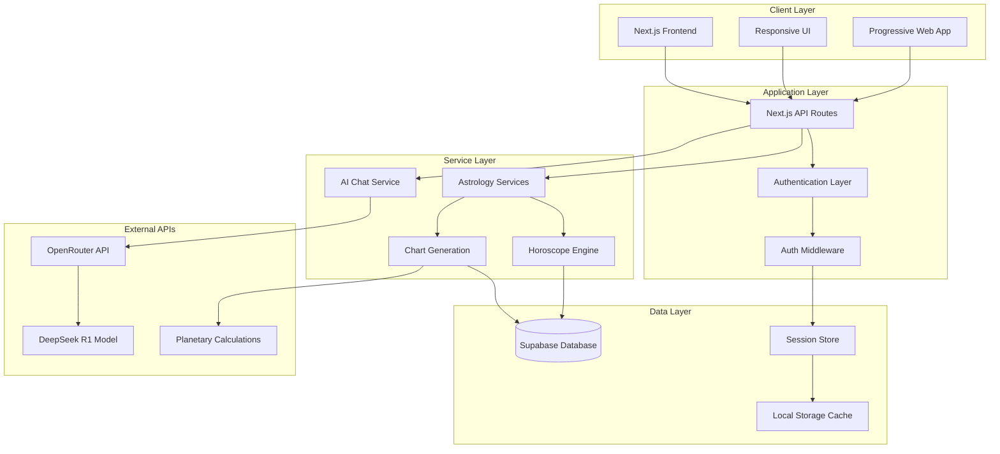

## 🛠️ Technology Stack

### Frontend
- **Next.js 15.3.3** - React framework with App Router
- **React 19** - UI library with latest features
- **TypeScript** - Type-safe development
- **TailwindCSS 4** - Utility-first CSS framework
- **Shadcn/ui** - Component library with Radix UI
- **Framer Motion** - Animation library
- **Lucide React** - Icon library

### Backend
- **Next.js API Routes** - Serverless backend functions
- **Supabase** - Backend-as-a-Service with PostgreSQL
- **Custom Session Management** - Secure session handling
- **Crypto-js** - Data encryption for sensitive information

### AI & Astrology
- **OpenRouter API** - AI model access gateway
- **DeepSeek R1** - Advanced AI model for astrological analysis
- **Custom Planetary Calculations** - Vedic astrology computations
- **Chart Generation** - SVG-based astrological charts

### Database
- **PostgreSQL** (via Supabase) - Primary database
- **Row Level Security** - Data access control
- **Real-time subscriptions** - Live data updates
- **Automated migrations** - Database version control

## 🏛️ System Architecture

### High-Level Architecture Flow

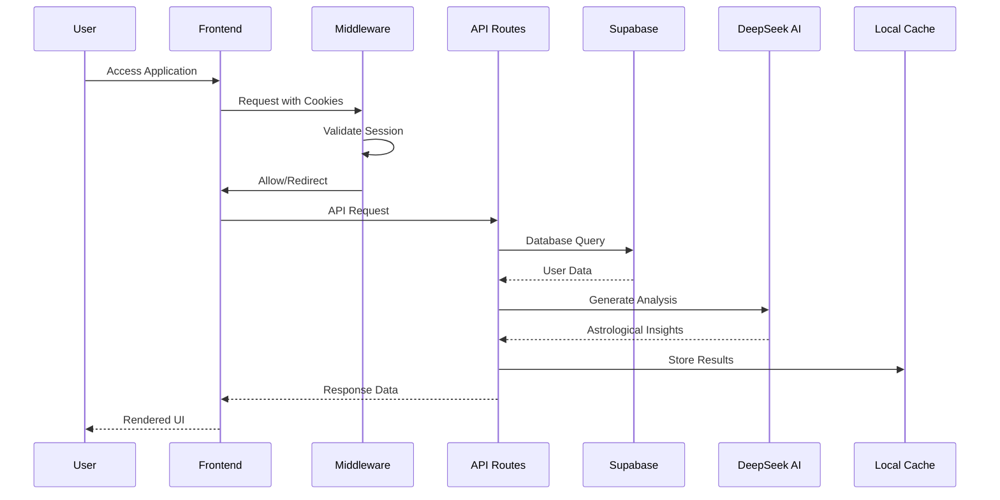

### Component Architecture

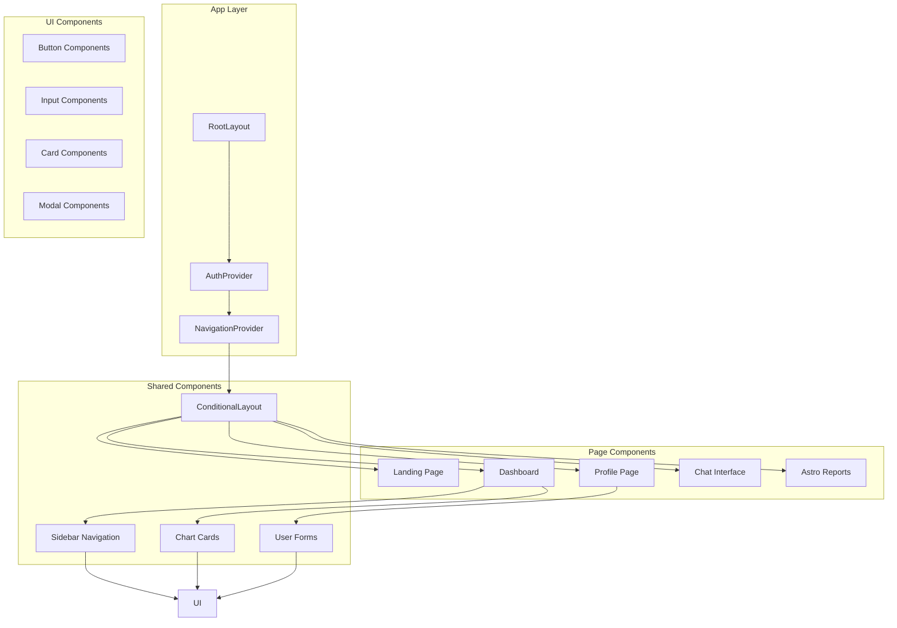

## 🔐 Authentication System

AstroCircle implements a custom authentication system with enhanced security features:

### Authentication Flow

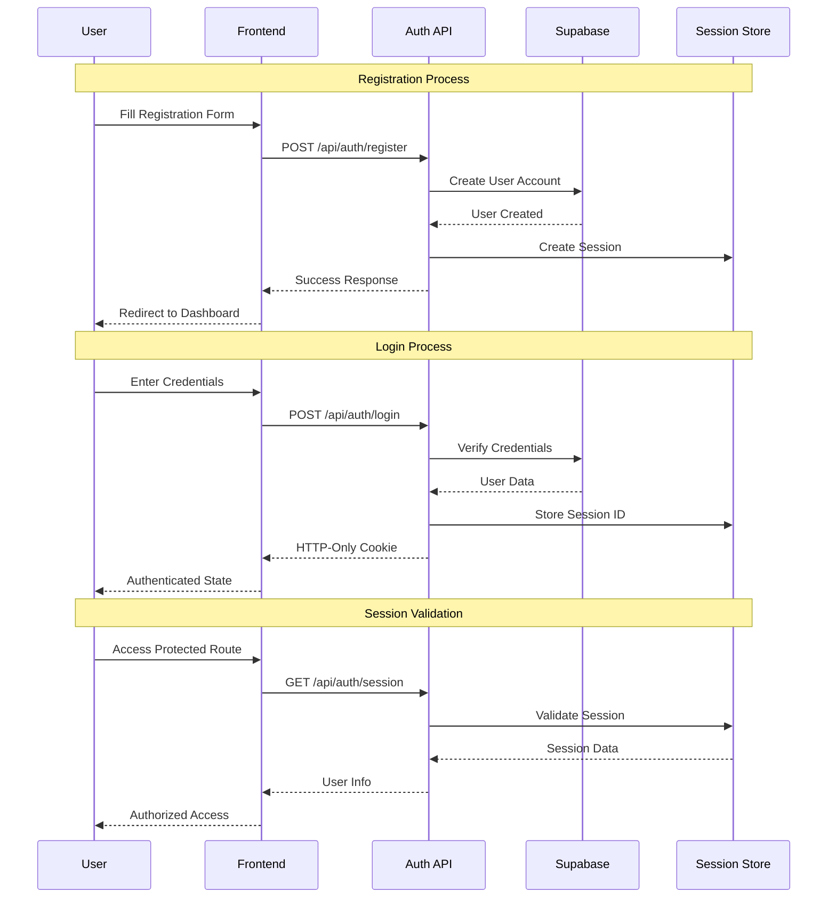

### Authentication Components

#### 1. **AuthContext** (`src/lib/AuthContext.tsx`)
- Client-side authentication state management
- Automatic session validation
- Timeout handling for slow connections
- Logout functionality

#### 2. **Session Management** (`src/lib/session-store.ts`)
- In-memory session storage with file persistence
- Encrypted session data
- Automatic cleanup of expired sessions
- Development-friendly session persistence

#### 3. **Authentication APIs**
- `/api/auth/login` - User login with credential validation
- `/api/auth/register` - New user registration
- `/api/auth/logout` - Secure logout with session cleanup
- `/api/auth/session` - Session validation endpoint

### Security Features

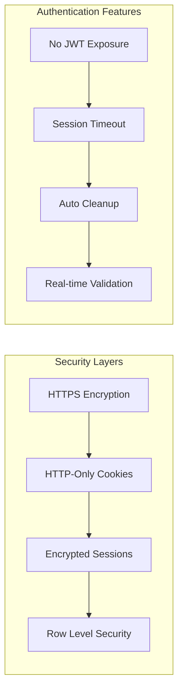

## 🗄️ Database Schema

### Core Tables Structure

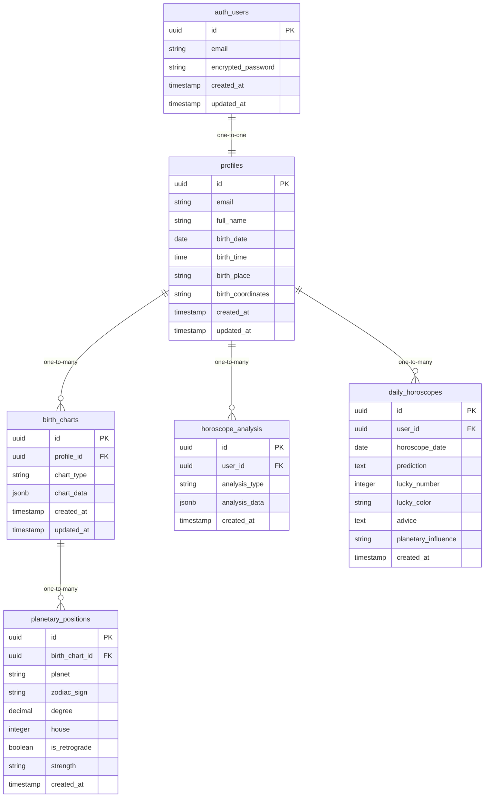

### Database Policies (Row Level Security)

```sql
-- Users can only access their own data
CREATE POLICY "Users can view own profile"
    ON public.profiles FOR SELECT
    USING (auth.uid() = id);

CREATE POLICY "Users can update own profile"
    ON public.profiles FOR UPDATE
    USING (auth.uid() = id);

-- Cascading security for related tables
CREATE POLICY "Users can view own birth charts"
    ON public.birth_charts FOR SELECT
    USING (auth.uid() = profile_id);
```

## 🔗 API Routes Structure

### Authentication Routes

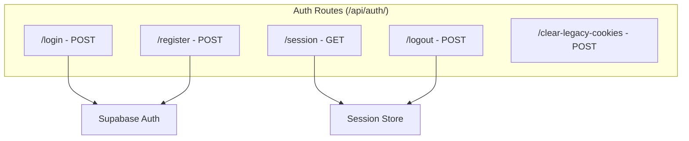

### Astrology Routes

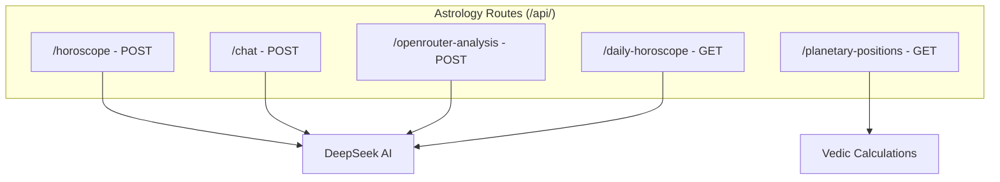

### API Implementation Details

#### 1. **Chat API** (`/api/chat/route.ts`)
```typescript
// Handles AI-powered astrological consultations
export async function POST(req: Request) {
  const { messages } = await req.json()
  
  const response = await fetch('https://openrouter.ai/api/v1/chat/completions', {
    method: 'POST',
    headers: {
      'Authorization': `Bearer ${process.env.OPENROUTER_API_KEY}`,
      'Content-Type': 'application/json'
    },
    body: JSON.stringify({
      model: 'deepseek/deepseek-r1-0528-qwen3-8b:free',
      messages: messagesWithSystem,
      temperature: 0.7,
      max_tokens: 700
    })
  })
}
```

#### 2. **Horoscope API** (`/api/horoscope/route.ts`)
```typescript
// Generates comprehensive horoscope readings
export async function POST(req: Request) {
  const { birthDate, birthTime, birthPlace } = await req.json()
  
  // Validates birth data and generates AI-powered insights
  // Returns structured JSON with health, career, love, wealth predictions
}
```

#### 3. **Planetary Positions** (`/lib/planetary-service.ts`)
```typescript
// Calculates Vedic planetary positions using AI
export async function getPlanetaryPositions(userId: string) {
  // 1. Check cache for existing calculations
  // 2. Fetch user birth data from Supabase
  // 3. Generate positions using DeepSeek AI
  // 4. Cache results for performance
  // 5. Return structured planetary data
}
```

## 🎨 Frontend Components

### Component Hierarchy

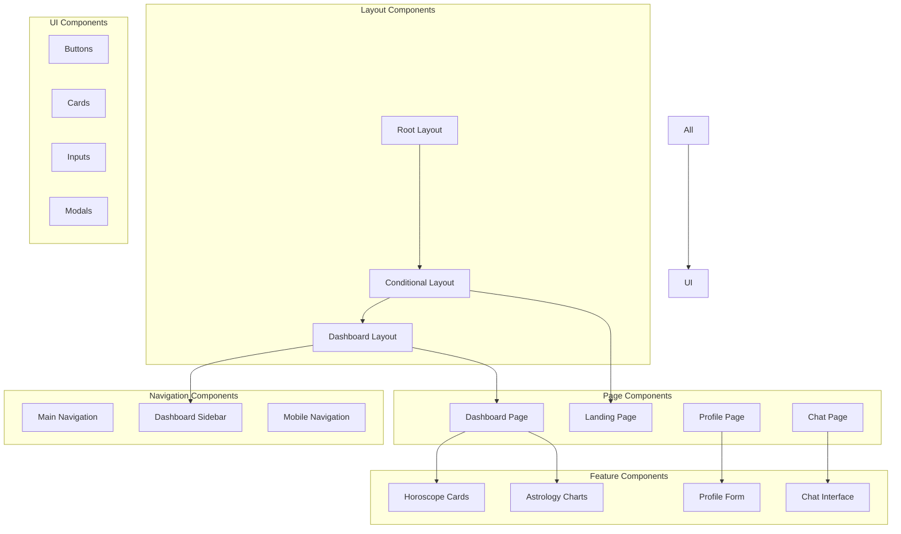

### Key Frontend Features

#### 1. **Conditional Layout System**
```typescript
// Automatically switches between landing and dashboard layouts
// based on authentication state
export function ConditionalLayout({ children }: { children: React.ReactNode }) {
  const { isAuthenticated, isLoading } = useAuth()
  const showDashboard = !isLoading && isAuthenticated && !isAuthPage
  
  // Returns appropriate layout based on auth state
}
```

#### 2. **Responsive Design**
- Mobile-first approach with TailwindCSS
- Progressive enhancement for larger screens
- Touch-friendly navigation and interactions
- Optimized for all device sizes

#### 3. **Animation & Interactions**
- Framer Motion for smooth animations
- Glassmorphism design with backdrop blur
- Interactive particle effects
- Smooth page transitions

#### 4. **Performance Optimization**
- Lazy loading of components
- Image optimization with Next.js
- Caching strategies for API responses
- Minimal bundle size with tree shaking

## 🤖 AI Integration (DeepSeek)

### AI Architecture

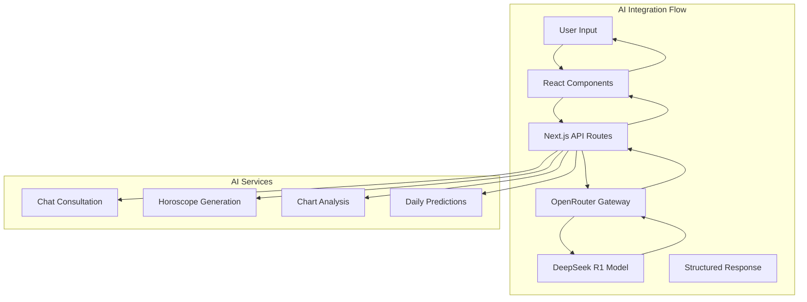

### AI Implementation Details

#### 1. **OpenRouter Integration**
```typescript
// Central AI service configuration
const response = await fetch('https://openrouter.ai/api/v1/chat/completions', {
  method: 'POST',
  headers: {
    'Authorization': `Bearer ${process.env.OPENROUTER_API_KEY}`,
    'Content-Type': 'application/json',
    'HTTP-Referer': 'https://astrocircle.vercel.app'
  },
  body: JSON.stringify({
    model: 'deepseek/deepseek-r1-0528-qwen3-8b:free',
    messages: systemPromptWithUserData,
    temperature: 0.7,
    max_tokens: 2000
  })
})
```

#### 2. **Specialized AI Prompts**

**Vedic Astrology System Prompt:**
```
You are an expert in Hindu Vedic Astrology with deep knowledge of:
- Birth chart analysis using Hindu astrology methods
- Planetary positions and their meanings in Hindu tradition
- Vedic remedies and traditional solutions
- Understanding of houses, signs, dashas, yogas, and nakshatras
- Traditional Hindu astrological texts and principles
```

**Chat Consultation Prompt:**
```
You are a Vedic astrologer. Give concise, direct answers (2-3 sentences max). 
Use Sanskrit planet names when relevant.
USER: ${name}, born ${birthDate} at ${birthTime} in ${birthPlace}
Provide personalized insights based on this birth data.
```

#### 3. **AI Response Processing**
```typescript
// Structured data extraction from AI responses
let analysisData = JSON.parse(content)

// Validation and fallback handling
if (!analysisData.health || !analysisData.career) {
  // Provide fallback structured response
  analysisData = generateFallbackResponse()
}

// Data cleaning and normalization
Object.keys(analysisData).forEach(key => {
  if (typeof analysisData[key] === 'string') {
    analysisData[key] = cleanJsonFormatting(analysisData[key])
  }
})
```

### AI Features

#### 1. **Real-time Chat Consultation**
- Personalized responses based on birth chart
- Context-aware conversations
- Sanskrit terminology integration
- Vedic remedy suggestions

#### 2. **Automated Horoscope Generation**
- Daily horoscope creation
- Health, career, love, wealth predictions
- Lucky numbers and colors
- Planetary influence analysis

#### 3. **Chart Analysis**
- Birth chart interpretation
- Yoga identification
- Dasha period analysis
- Detailed planetary meanings

## 🔮 Astrology Features

### Vedic Astrology Implementation

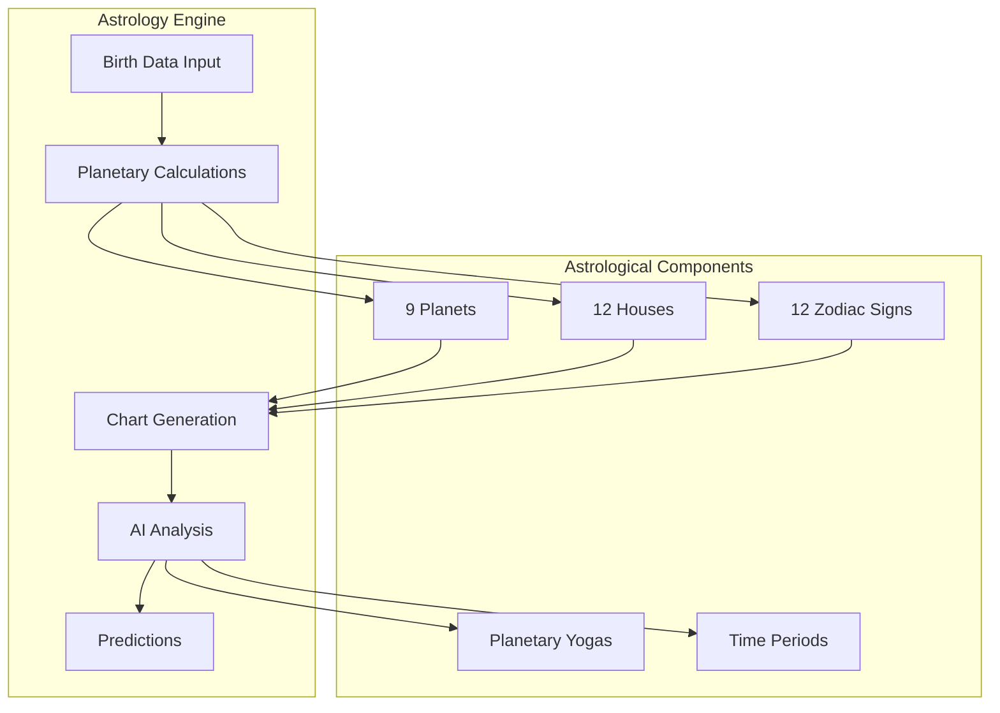

### Astrological Features

#### 1. **Planetary Position Calculator**
```typescript
interface PlanetaryPosition {
  name: string        // Sanskrit planet names
  house: number      // 1-12 house positions
  sign: string       // Zodiac sign in Sanskrit
  degree: number     // Exact degree position
}

// AI-powered planetary calculations
const positions = await calculatePlanetaryPositions(birthDate, birthTime)
```

#### 2. **Birth Chart Analysis**
- Complete natal chart interpretation
- Planetary strength assessment
- House significances
- Yoga formations
- Dasha predictions

#### 3. **Daily Horoscope System**
- Personalized daily predictions
- Transit analysis
- Lucky elements identification
- Practical advice generation

#### 4. **Vedic Remedies**
- Traditional puja recommendations
- Gemstone suggestions
- Mantra prescriptions
- Dietary guidelines
- Charitable activities

### Chart Generation

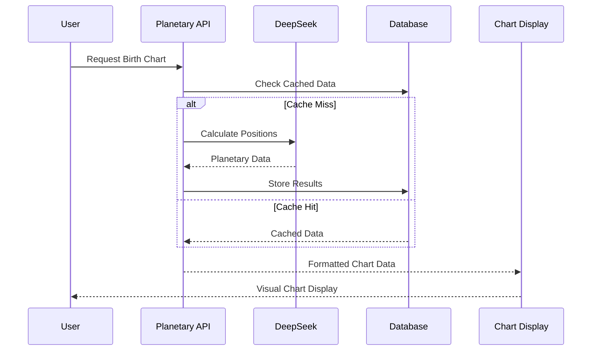

## 🚀 Development Setup

### Prerequisites
```bash
Node.js 18+
npm or yarn
Supabase account
OpenRouter API key
```

### Environment Setup
```bash
# Clone repository
git clone https://github.com/your-username/astrocircle.git
cd astrocircle

# Install dependencies
npm install

# Setup environment variables
cp .env.example .env.local
```

### Environment Variables
```env
# Supabase Configuration
NEXT_PUBLIC_SUPABASE_URL=your_supabase_url
NEXT_PUBLIC_SUPABASE_ANON_KEY=your_supabase_anon_key
SUPABASE_SERVICE_ROLE_KEY=your_service_role_key

# OpenRouter AI Configuration
OPENROUTER_API_KEY=your_openrouter_api_key

# App Configuration
NEXT_PUBLIC_APP_URL=http://localhost:3000
```

### Database Setup
```bash
# Start Supabase locally
npm run supabase:start

# Apply migrations
npm run db:push

# Generate TypeScript types
npm run types:generate
```

### Development Commands
```bash
# Start development server
npm run dev

# Build for production
npm run build

# Start production server
npm start

# Run linting
npm run lint

# Database commands
npm run db:reset      # Reset database
npm run db:diff       # Show schema differences
```

### Project Structure
```
astrocircle/
├── src/
│   ├── app/                    # Next.js App Router
│   │   ├── (auth)/            # Authentication pages
│   │   ├── api/               # API routes
│   │   ├── dashboard/         # Dashboard pages
│   │   └── globals.css        # Global styles
│   ├── components/            # React components
│   │   ├── auth/             # Authentication components
│   │   ├── chat/             # Chat interface
│   │   ├── dashboard/        # Dashboard components
│   │   └── ui/               # Reusable UI components
│   ├── lib/                  # Utility libraries
│   │   ├── hooks/            # Custom React hooks
│   │   ├── supabase/         # Database queries
│   │   └── utils.ts          # Helper functions
│   └── types/                # TypeScript type definitions
├── supabase/
│   ├── migrations/           # Database migrations
│   └── config.toml          # Supabase configuration
├── public/                   # Static assets
└── package.json             # Dependencies and scripts
```

## 🔒 Security Features

### Security Implementation

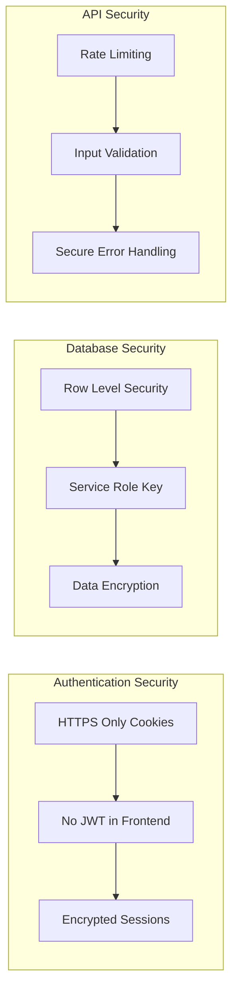

### Security Measures

#### 1. **Authentication Security**
- HTTP-only cookies prevent XSS attacks
- No JWT tokens exposed to client
- Encrypted session storage
- Automatic session cleanup

#### 2. **Database Security**
- Row Level Security (RLS) policies
- Service role key for admin operations
- Encrypted sensitive data storage
- Audit logging for data access

#### 3. **API Security**
- Input validation on all endpoints
- Rate limiting for AI API calls
- Secure error handling
- CORS configuration

#### 4. **Data Protection**
- Local storage encryption for cached data
- Secure cookie configuration
- Environment variable protection
- API key security

## 🚢 Deployment

### Production Deployment

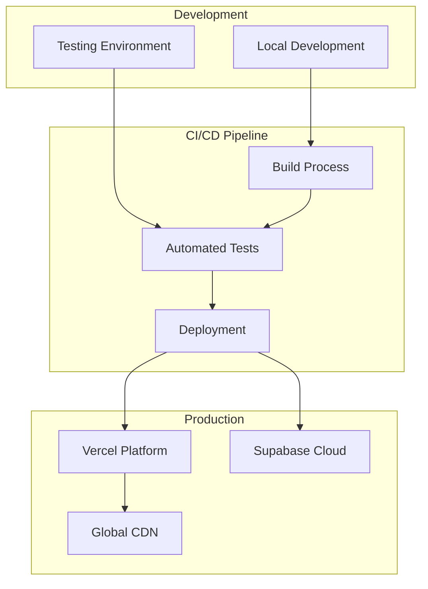

### Deployment Steps

#### 1. **Vercel Deployment**
```bash
# Install Vercel CLI
npm i -g vercel

# Deploy to Vercel
vercel --prod

# Configure environment variables in Vercel dashboard
```

#### 2. **Supabase Production Setup**
```bash
# Create production Supabase project
# Run migrations in production
supabase db push --project-ref your-project-ref

# Configure production environment variables
```

#### 3. **Environment Configuration**
```env
# Production environment variables
NEXT_PUBLIC_SUPABASE_URL=https://your-project.supabase.co
NEXT_PUBLIC_SUPABASE_ANON_KEY=your-production-anon-key
SUPABASE_SERVICE_ROLE_KEY=your-production-service-key
OPENROUTER_API_KEY=your-production-openrouter-key
NEXT_PUBLIC_APP_URL=https://your-domain.com
```

### Performance Optimization

#### 1. **Frontend Optimization**
- Static site generation where possible
- Image optimization with Next.js
- Lazy loading of components
- Bundle size optimization

#### 2. **API Optimization**
- Response caching strategies
- Database query optimization
- AI response caching
- Connection pooling

#### 3. **Database Optimization**
- Indexed database queries
- Query performance monitoring
- Connection management
- Backup strategies

## 📊 Monitoring & Analytics

### Application Monitoring

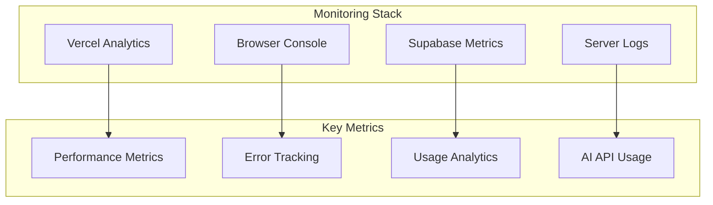

### Key Performance Indicators

1. **User Engagement**
   - Daily active users
   - Session duration
   - Feature usage patterns
   - Conversion rates

2. **Technical Performance**
   - Page load times
   - API response times
   - Error rates
   - Database performance

3. **AI Performance**
   - OpenRouter API usage
   - Response quality metrics
   - User satisfaction scores
   - Cost optimization

## 🔮 Future Enhancements

### Planned Features

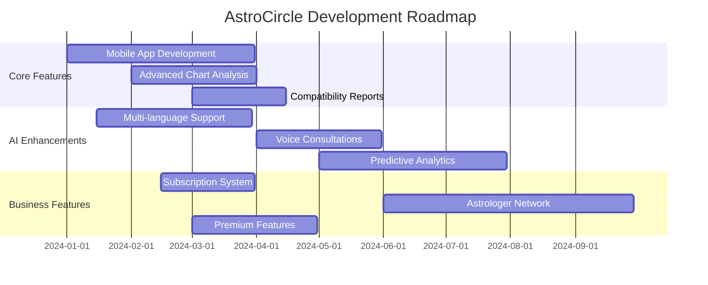

### Upcoming Developments

1. **Enhanced AI Features**
   - Multi-model AI integration
   - Voice-based consultations
   - Predictive analytics
   - Advanced chart synthesis

2. **Mobile Application**
   - React Native implementation
   - Push notifications
   - Offline functionality
   - Native performance optimization

3. **Advanced Astrology**
   - Compatibility matching
   - Transit predictions
   - Muhurta calculations
   - Prashna (horary) astrology

4. **Business Features**
   - Subscription management
   - Professional astrologer network
   - Marketplace for services
   - Advanced analytics dashboard

## 🤝 Contributing

### Development Guidelines

1. **Code Standards**
   - TypeScript for type safety
   - ESLint for code quality
   - Prettier for formatting
   - Conventional commits

2. **Testing Requirements**
   - Unit tests for utilities
   - Integration tests for APIs
   - E2E tests for critical flows
   - Performance testing

3. **Security Compliance**
   - Security review for new features
   - Data privacy compliance
   - Regular dependency updates
   - Vulnerability scanning

### Getting Started with Development

```bash
# Fork the repository
git clone https://github.com/your-username/astrocircle.git

# Create feature branch
git checkout -b feature/new-feature

# Make changes and commit
git commit -m "feat: add new astrological feature"

# Push and create pull request
git push origin feature/new-feature
```

## 📄 License

All rights reserved.

---

**AstroCircle** - Bringing ancient Vedic wisdom to the modern digital age through cutting-edge technology and AI-powered insights. ✨🌟

**siddhant bhasin production**
